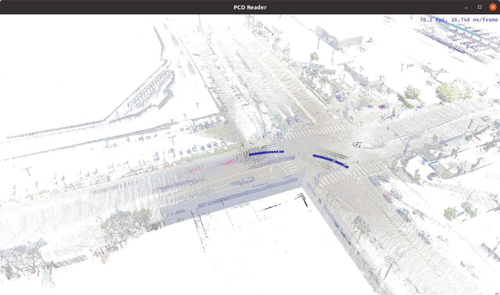
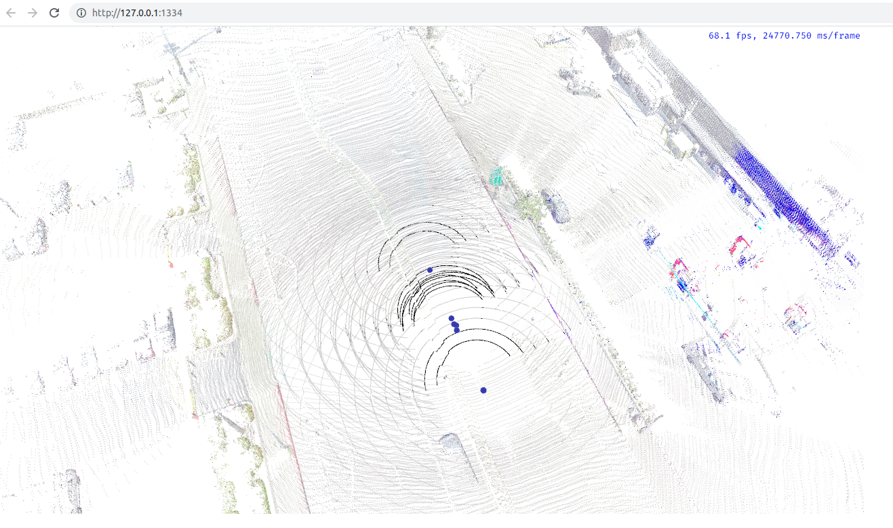

render-pcd-rs
=======
An app based on [Bevy Engine](https://bevyengine.org/) to render point cloud both as native app and browser app.

## Development
The project requires the following tools configured on your developer machine:
- Git LFS
- Rust compiler and Cargo, check https://www.rust-lang.org/tools/install on how to install both
- wasm-bidgen-cli installed `cargo install -f wasm-bindgen-cli --version 0.2.91`

## How to compile and run native version
```bash
➜  render-pcd-rs git:(main) ✗ cargo run
```
Once it compiles and runs, you should see 


## How to compile and run browser version
```bash
➜  render-pcd-rs git:(main) ✗ cargo run --target wasm32-unknown-unknown
...
    Finished dev [optimized + debuginfo] target(s) in 9.87s
     Running `wasm-server-runner target/wasm32-unknown-unknown/debug/pcd-renderer.wasm`
 INFO wasm_server_runner: compressed wasm output is 5.67mb large
 INFO wasm_server_runner::server: starting webserver at http://127.0.0.1:1334
```
Open the link http://127.0.0.1:1334 in your browser, you should see


### Issues with WASM
If you're getting something like this in your console:
```
     Running `wasm-server-runner target/wasm32-unknown-unknown/debug/pcd-renderer.wasm`
thread 'main' panicked at 'index out of bounds: the len is 0 but the index is 0', /home/user/.cargo/registry/src/github.com-1ecc6299db9ec823/wasm-bindgen-cli-support-0.2.83/src/descriptor.rs:208:15
stack backtrace:
   0: rust_begin_unwind
             at /rustc/a55dd71d5fb0ec5a6a3a9e8c27b2127ba491ce52/library/std/src/panicking.rs:584:5
   1: core::panicking::panic_fmt
             at /rustc/a55dd71d5fb0ec5a6a3a9e8c27b2127ba491ce52/library/core/src/panicking.rs:142:14
   2: core::panicking::panic_bounds_check
             at /rustc/a55dd71d5fb0ec5a6a3a9e8c27b2127ba491ce52/library/core/src/panicking.rs:84:5
   3: wasm_bindgen_cli_support::descriptor::Descriptor::_decode
   4: wasm_bindgen_cli_support::descriptor::Function::decode
   5: wasm_bindgen_cli_support::descriptor::Descriptor::_decode
   6: wasm_bindgen_cli_support::descriptor::Descriptor::decode
   7: wasm_bindgen_cli_support::Bindgen::generate_output
   8: wasm_server_runner::wasm_bindgen::generate
   9: wasm_server_runner::main
note: Some details are omitted, run with `RUST_BACKTRACE=full` for a verbose backtrace.
```
Try to uninstall and install again `wasm-server-runner`