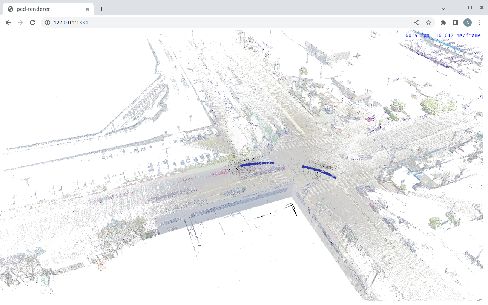

render-pcd-rs
=======
An app based on [Bevy Engine](https://bevyengine.org/) to render point cloud both as native app and browser app.

## Development
The project requires the following tools configured on your developer machine:
- Git LFS
- Rust compiler and Cargo, check https://www.rust-lang.org/tools/install on how to install both

## How to compile and run native version
```bash
➜  render-pcd-rs git:(main) ✗ cargo run
```
Once it compiles and runs, you should see 


## How to compile and run browser version
```bash
➜  render-pcd-rs git:(main) ✗ cargo run --target wasm32-unknown-unknown
...
    Finished dev [optimized + debuginfo] target(s) in 9.87s
     Running `wasm-server-runner target/wasm32-unknown-unknown/debug/pcd-renderer.wasm`
 INFO wasm_server_runner: compressed wasm output is 5.67mb large
 INFO wasm_server_runner::server: starting webserver at http://127.0.0.1:1334
```
Open the link http://127.0.0.1:1334 in your browser, you should see
